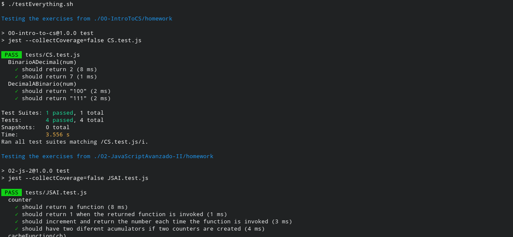

# bash-stuff

Random scripts and snippets to automate menial tasks

Most of them are also commented on painful detail, just in case some poor soul stumbles upon this and tries to use it to learn bash

Written with love and heavily inspired by Larry Wall's [Three Cardinal Virtues](https://avdi.codes/the-three-virtues/) of a programmer: Laziness, Impatience, and Hubris.

---

### [installDependencies.sh](./installDependencies.sh)
This script will angrily look for folders named "homework" that have a "package.json" file and perform a simple "npm install" operation on them. Built with [soyhenry.com's](https://www.soyhenry.com/) bootcamp students in mind.

PS: You can go look for the actual logs on each `homework/dependencies.log` and `homework/dependencies.err`

---

### [testEverything.sh](./testEverything.sh)
Little sis to [installDependencies](./installDependencies.sh) above, this one performs tests on every homework that allows for it using a closely similar method.

Because I needed to show off I can successfuly complete a for loop. Don´t judge me

